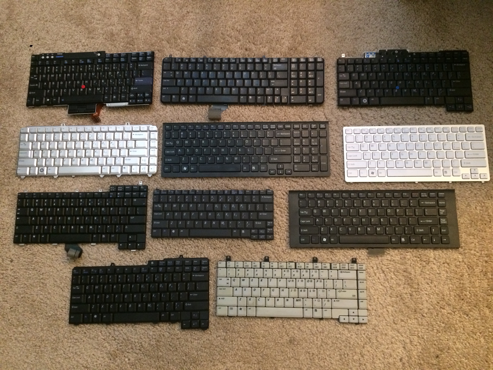

# USB_Laptop_Keyboard_Controller
 This repo contains all the files that are needed to make a USB keyboard/touchpad controller as well as a KVM from an old laptop.

 See the USB keyboard video at https://vimeo.com/458595950 and the updated video at https://vimeo.com/888367797?share=copy
 
 See the keyboard Instructable at https://www.instructables.com/id/How-to-Make-a-USB-Laptop-Keyboard-Controller/

 Instead of the manual method to create the key matrix, use Marcel's Python program which I've forked and updated so it will work with the Teensy 4.0, 4.1, and 2.0++. 
 
 The updated Python code is here:
 
 https://github.com/thedalles77/USB_Laptop_Keyboard_Controller-1/blob/master/matrixgenerator.py
 
 See the KVM Instructable at https://www.instructables.com/DIY-Portable-KVM-Crashcart-From-Recycled-Laptop-Pr/ 
